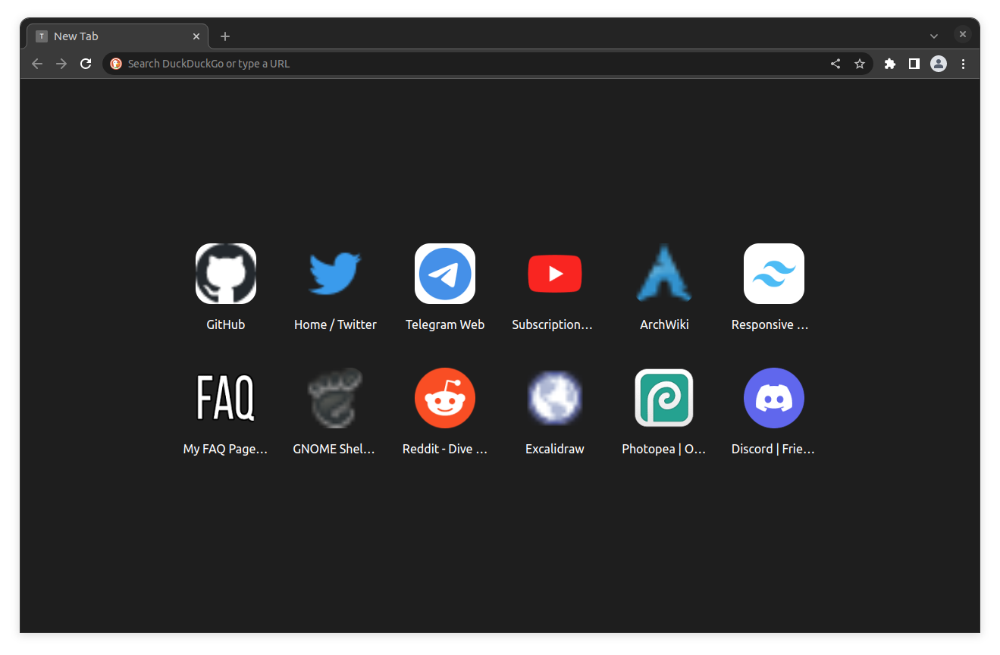

# Minimal New Tab Extension

Default New Tab page in Brave is awful. Let's fix it!

This extension displays 12 of the most visited sites on your new tab page and nothing more.

## Installation

You can install it from Chrome Web Store - https://chrome.google.com/webstore/detail/minimal-new-tab/djhildgdgcneodgamcmcebohmcjogbol?hl=en&authuser=0

Manual install:

1. Clone the repo
2. Go to `brave://extensions/`
3. Enable "Developer mode" in the top right corner
4. Click on "Load unpacked" and choose the folder where you cloned this repo
